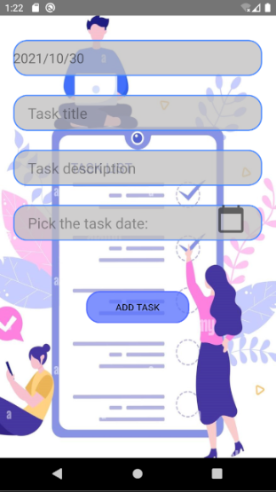

# MarahSB, Repo: Marah_IndividualProject "My Task Manager"
To do List individual project - week 5 - Tuwaiq Bootcamp

<!--- Replace <MarahSB> with your Github Username and <Marah_IndividualProject> with the name of your repository. -->
<!--- You can find both of these in the url bar when you open your repository in github. -->

## :scroll: Description
---
This application is made to ease your life, and manage your important tasks with the ability to add, modify and delete any task and filtering tasks by today tasks to get done 📅✅.

## :bulb: Motivation and Context
---
By using this application you will have a frequently updated features and make your life easer and manage your daily, weekly or even monthly tasks with a simple interface and user friendly😉.

## :camera_flash: Screenshots
---
### screenshot_1

### screenshot_2

### screenshot_3

### screenshot_4

### screenshot_5
